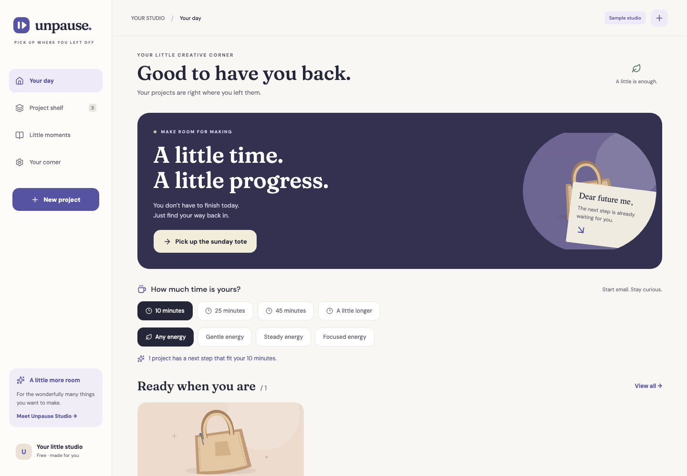

<div align="center">
  
  <h1>Unpause</h1>
  <p><strong>Less remembering. More making.</strong></p>
  <p>A home for your half-made things. Save where you stopped, find the next small step,<br/>and make a little room for making.</p>
  <p>Created by <strong>Shivam Gupta</strong> · RevenueCat Shipaton 2026</p>
</div>

**[Open the live app](https://unpause-studio.web.app)** · [Privacy](https://unpause-studio.web.app/privacy) · [Terms](https://unpause-studio.web.app/terms) · [Support](https://unpause-studio.web.app/support)

The hosted app includes real Firebase email/password account integration. Projects and photos remain local to your device; accounts do not sync them. RevenueCat is configured, and the native Test Store purchase/restore workflow is verified. Production store purchases remain pending. The current Android preview passed an in-place emulator upgrade, cold launch and local sample-project preservation. Native sign-in, offline account persistence and deletion passed on an earlier APK; repeating those account checks on the current APK was blocked by emulator input automation, so they are not claimed for this exact build. Physical-device account/billing checks remain release gates. iOS source bundles successfully, but no signed iOS build or store publication is claimed.

## Why this exists

You finally have ten spare minutes. The half-sewn bag is waiting, but where did you stop? Which pieces were cut? What was the next step?

Unpause keeps that context. Its signature loop is **choose a little time → read your last handoff → make one small step → leave a note for future you**. It works across sewing, woodworking, art, gardening, repairs, and other physical projects. There are no streaks, deadlines, or invented AI instructions.



*Actual web UI with clearly labeled sample projects. Watch the [public narrated native demo](https://www.youtube.com/watch?v=jXpOlvDShRY), or open the [submission kit](artifacts/submission/README.md) for screenshots, captions, the deck, and the PDF brief.*

## Try it

An installable Android preview is available in [GitHub Releases](https://github.com/shi1720/RevenueCat-Shipaton/releases). It runs offline without a development server and uses a test signing certificate. Preview 2 includes real Firebase accounts and encrypted native sessions. Production purchases still require actual store products and approval. A separate internal Test Store APK is debug-only and needs Metro; it is not this offline preview. The source repository and release downloads are public. The latest standalone APK and its exact test limits are in [Preview 3](https://github.com/shi1720/RevenueCat-Shipaton/releases/tag/v1.0.0-preview.3).

Requires Node.js 22 LTS and npm. No API key is needed for the local studio.

```sh
npm ci
npm run web
```

Open the URL Expo prints. Choose **Explore a sample studio** for an immediately usable demonstration, or **Make room for my projects** for an empty personal workspace. Sample content is explicitly labeled.

For mobile development:

```sh
npm start
# Or, with the appropriate native toolchain:
npx expo run:android
npx expo run:ios
```

Expo Go can preview core features on a compatible SDK. Real store purchases require a development or store build, not Expo Go. iOS native builds require Xcode or an owner-configured EAS build.

## What is implemented

| Experience | Behavior |
|---|---|
| Project shelf | Create, search, edit, reopen, finish, and delete projects; six craft categories |
| Time-fit return | Find next steps that fit 10, 25, 45, or 90 minutes and your energy; blocked steps rank after unblocked ones |
| Project memory | Last stopping point, next action, materials location, blocker, and photos |
| Making session | Persistent timer survives app restart; one active session at a time |
| Pause ritual | Save a checkpoint, attach a photo, and choose the next step’s duration |
| History | Read each checkpoint and cumulative session time; finished projects remain accessible |
| Photos | Library selection on web/native; camera capture on native; local durable storage |
| Gentle reminder | Optional local notification tomorrow at 6 p.m.; explicit permission and cancellation |
| Data ownership | Portable JSON backup with embedded photos, validated restore, readable text handoff |
| Account | Firebase identity and a deployed Supabase endpoint coordinating Firebase/RevenueCat account deletion; project data remains local |
| Studio | Configured RevenueCat lifetime offering and verified native Test Store cancellation/failure/success/restore/restart; production store purchases pending |
| Responsive UI | Phone navigation, wider project layout, tablet/desktop sidebar, resizable Android activity |

**Accounts do not sync projects.** Project data stays on the device, including after signing out. A backup is the way to transfer projects. Web reminders are explicitly unavailable. Native permissions are requested when the user invokes the relevant feature.

## Build status and launch boundary

The repository includes the implementation, tests, native build profiles, and submission materials. **A store release has not been published.** Missing provider configuration is shown honestly; the app never simulates a successful login, payment, or cloud sync.

RevenueCat project `projb008cb09` and the coordinated Firebase/purchase-profile deletion backend are configured. Live paid release still requires actual store products and connections, production signing, Samsung corporate commercial seller approval (for Galaxy), physical store-device purchase testing, and store review. Samsung account registration is complete, but Android app registration is blocked pending that approval. Public web hosting and policy/support pages are available; live account/email evidence is tracked separately. Start with [Shivam’s owner setup](docs/OWNER_SETUP.md), then the [launch checklist](docs/release/launch-checklist.md) and [native build evidence](docs/release/native-build-evidence.md). A locally built APK is a testing artifact, not proof of Galaxy acceptance.

## Monetization

Existing imported memories are always retained, even above the free plan limit; creating or reopening additional projects requires room on the shelf or Studio. The free studio allows **three open projects**, with finished projects, checkpoints, reminders, and backups included. **Studio** removes the open-project plan limit with one lifetime purchase. **$19.99 is the launch pricing hypothesis**, not a fabricated live store price. Checkout always displays the actual localized store product price.

The app’s core has no model inference, hosted photo storage, or required paid backend costs. The business case, alternatives, honest competitive analysis, assumptions, and validation experiments are in [docs/business.md](docs/business.md). No users, revenue, retention, or competitive moat are claimed without evidence.

## Accounts and purchases

Copy the template locally, then fill only your own provider values:

```sh
cp .env.example .env.local
```

Existing local configuration is already populated; do not overwrite `.env.local` on this workspace with the empty template. Read [Firebase account setup](docs/release/firebase-accounts.md), [the deployed deletion backend](docs/release/firebase-deletion-backend.md), and [owner setup](docs/OWNER_SETUP.md). Public client configuration goes in Expo public variables; administrative and RevenueCat secret keys belong only in the appropriate authenticated deletion backend. Never commit credentials or signing material.

RevenueCat project: `projb008cb09`. Entitlement: `studio`. Offering: `default`. Package: `$rc_lifetime`. Product: `unpause_studio_lifetime`. Galaxy, iOS, Google Play, and Test Store mappings exist. Native Test Store cancellation, failure, success, restore, and cold restart were verified. These simulated transactions establish no production purchase or revenue. Test Store mode is restricted to the internal development client, and the production release gate rejects its flags and keys.

## Verification

```sh
npm run typecheck
npm test
npm run export:web -- --clear
# For the configured Firebase build:
E2E_AUTH_CONFIGURED=1 npm run test:e2e
# For a credential-free export, omit E2E_AUTH_CONFIGURED.
npm run export:native
npx expo-doctor
```

Vitest covers project transitions, import invariants, persistence failures, authentication, and billing identity races. Playwright covers real UI flows at phone and desktop widths. The Supabase Deno function is checked separately:

```sh
npx --yes deno check --config supabase/functions/delete-firebase-account/deno.json supabase/functions/delete-firebase-account/index.ts
```

Unit/service, browser, and backend checks exercise failure handling as well as successful flows. Live provider checks cover Firebase accounts and coordinated RevenueCat deletion. A bundled Android preview was compiled and launched offline; the newer native Test Store client requires Metro. The final review passed **154 unit tests and 30 desktop/mobile browser scenarios**, type checking, formatting, iOS/Android bundle exports, and three Firebase Admin Deno tests. The deployed deletion backend passed 15 live checks; four temporary identities were removed with no cleanup errors. Read the [verification ledger](docs/release/verification.md) for exact scope, native evidence, and checks that still require real provider accounts or physical devices.

The production gate fails when credentials or public policy/support URLs are incomplete:

```sh
npm run check:release -- --platform android --check-urls
```

That gate verifies configuration, **not** successful transactions or store eligibility. Test the full purchase/cancel/restore/reinstall/account-switch flow in each target store’s sandbox before release.

## Native distributions

See [build instructions](docs/release/build.md) for Google Play, Galaxy, and iOS. EAS profiles define the store variants; the optional local Android script uses an isolated toolchain and never changes your shell’s global environment.

```sh
EXPO_PUBLIC_ANDROID_STORE=galaxy npx eas-cli build --platform android --profile production-galaxy
EXPO_PUBLIC_ANDROID_STORE=google npx eas-cli build --platform android --profile production-google
npx eas-cli build --platform ios --profile production-ios
```

Samsung publishing has no registration/annual fee, but commercial seller approval and a physical Samsung device for purchase testing remain prerequisites. [Official Samsung preparation guidance](https://developer.samsung.com/galaxy-store/prepare.html).

## Submission kit

- [Complete artifact index and native walkthrough](artifacts/submission/README.md)
- [Verbatim demo script and shot timeline](docs/submission.md)
- [Editable pitch deck](artifacts/submission/Unpause-pitch-final.pptx)
- [Two-page judge brief](artifacts/submission/Unpause-brief.pdf)
- [Store listing copy](docs/release/store-listing.md)
- [Official rules and rubric research](docs/research/hackathon.md)
- [Competitive research](docs/research/market.md)
- [Independent review](docs/review.md)

Submission should describe Shivam Gupta as the creator. Sample projects and demo stories are illustrative, not invented customer traction or personal history. The [Devpost entry is submitted](https://devpost.com/software/unpause-k9p21y). Its store-release declaration remains false. Update the entry and demo with real production-store evidence when available; the current public video and Test Store checks do not establish eligibility.

## Code map

```text
App.tsx                 Navigation, account lifecycle, sheets, responsive shell
src/domain/             Pure models, validation, time-fit selection, samples
src/screens/            Studio, project, checkpoint, account, recovery interfaces
src/services/           Storage, photos/backups, notifications, auth, purchases
src/components/         Shared UI, theme, original project illustrations
supabase/               Firebase/RevenueCat deletion service and coordination
plugins/                Android purchase/activity configuration
scripts/                Build, release checks, asset and submission generation
tests/                  Unit, integration, and browser tests
```

Project content stays local. Firebase handles identity, RevenueCat handles entitlements, and Supabase hosts coordinated account/purchase-profile deletion. The older Supabase identity adapter remains an optional code fallback. Neither service uploads project notes or photos. Media is copied to app-owned files on native, embedded into backups when exported, and validated before restore. Destructive actions require an explicit in-app confirmation.

## Credits and licensing

Unpause concept, product, and submission: **Shivam Gupta**, developed with AI assistance. Original logo and craft illustrations are repository-native vector artwork. DM Sans and Fraunces are distributed under the SIL Open Font License; see [THIRD_PARTY_NOTICES.md](THIRD_PARTY_NOTICES.md). Source code is MIT licensed. Third-party libraries retain their respective licenses.

Public standalone Android preview: [download and release notes](https://github.com/shi1720/Unpause-Preview/releases/tag/v1.0.0-preview.3). This ARM64 build uses a development test certificate, includes its JavaScript, and has no live checkout. The download returned HTTP 200 without authentication, with the verified APK byte count. Firebase Spark rejects executable uploads, so only the app and support pages use Firebase Hosting.
